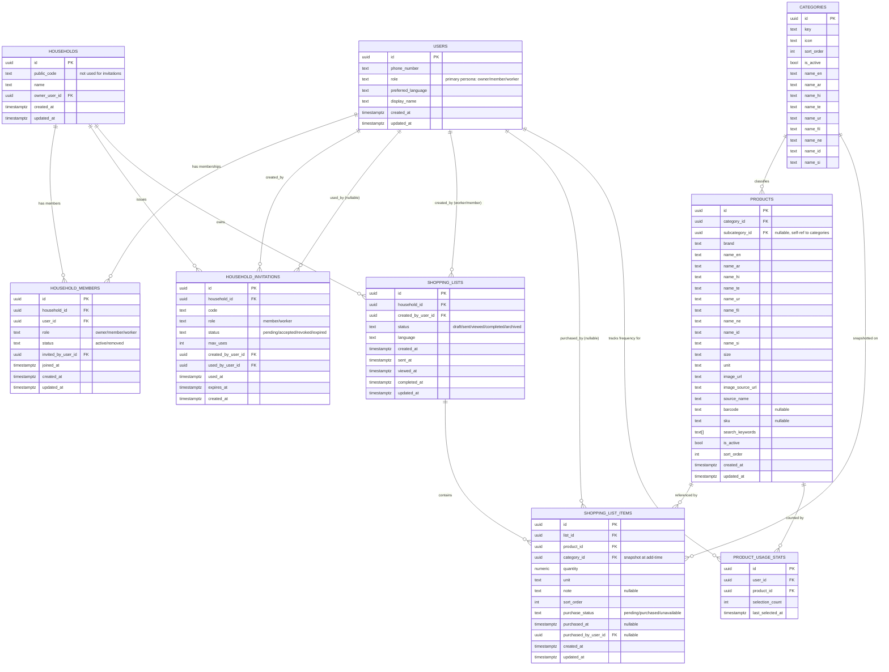

# 02 — Database ERD

Full column-level detail lives in `03-database-schema.md`. This document is
the relationship map.

## Notes on relationships

- `households.owner_user_id` is a convenience denormalization of "the
  household_members row with role=owner" — it exists so ownership can be
  read without a join, but the **authoritative** owner is still whichever
  `household_members` row has `role='owner', status='active'`. A future
  ownership-transfer feature would update both in one transaction.
- `shopping_list_items.category_id` intentionally duplicates
  `products.category_id` at the time the item was added — see
  `13-shopping-list-grouping-checklist.md` for why this is a deliberate
  snapshot, not normalization debt.
- `product_usage_stats` backs Section 19 ("My Usual Items") — a simple
  per-user, per-product counter, no AI.
- No table stores OTP codes; Supabase Auth owns that internally (master
  plan rule 29.13).
